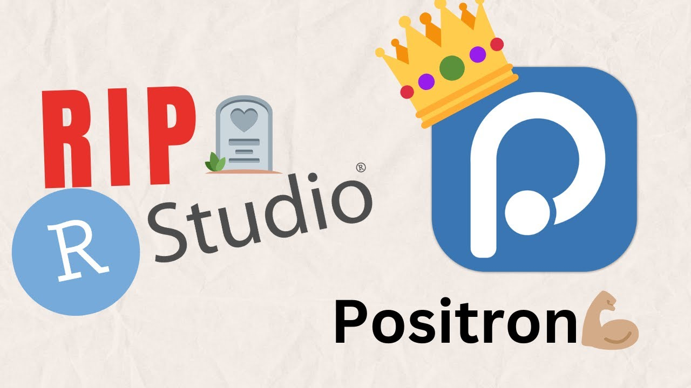

## Positron

O [Positron](https://positron.posit.co/){target="_blank"} é um ambiente de desenvolvimento integrado (IDE) gratuito, desenvolvido pela Posit (empresa criadora do RStudio), para programação em R e Python. Entre seus principais recursos estão:

- Editor de código moderno;
- Console interativo para execução de comandos;
- Gerenciamento de arquivos e projetos;
- Visualização de gráficos e exploração de dados;
- Criação de documentos em Quarto;
- Suporte a extensões e integração com ferramentas de inteligência artificial.

Em comparação ao RStudio, o Positron possui uma interface mais moderna e foi desenvolvido sobre uma arquitetura mais recente, proporcionando maior flexibilidade para diferentes fluxos de trabalho. Embora ainda esteja em desenvolvimento ativo, a Posit tem concentrado seus esforços em sua evolução e na incorporação de novos recursos.

Para utilizá-lo, é necessário que a linguagem de programação desejada esteja instalada no computador.

Utilizaremos o Positron por representar a nova geração de ambientes de desenvolvimento, oferecendo uma interface moderna e recursos que facilitam a organização de projetos e o desenvolvimento de análises reprodutíveis.

{width="50%" fig-align="center"}


### Instalação

1. Acesse a página de download do [Positron](https://positron.posit.co/download.html){target="_blank"}.
2. Selecione o sistema operacional do seu computador (Windows, macOS ou Linux).
3. Baixe a versão mais recente correspondente ao seu sistema.
4. Execute o instalador e siga as instruções padrão de instalação.


### Formatação automática do código

O Positron pode formatar o código automaticamente sempre que um arquivo for salvo. Essa funcionalidade ajuda a manter o código organizado, com indentação, espaçamento e quebras de linha padronizados.

A configuração pode ser feita uma única vez nas **User Settings** do Positron e, dessa forma, será aplicada aos diferentes projetos.

Para configurar:

1. Abra as configurações do Positron:
   - Windows/Linux: `Ctrl + Shift + P`
   - macOS: `Cmd + Shift + P`

2. Procure por **Preferences: Open User Settings (JSON)** e selecione essa opção.

3. No arquivo `settings.json`, adicione as configurações abaixo:

```json
{
    "files.associations": {
        "renv.lock": "json"
    },
    "workbench.colorTheme": "Default Positron Dark",
    "git.enableSmartCommit": true,
    "git.confirmSync": false,
    "positron.assistant.notebook.ghostCellSuggestions.enabled": true,
    "console.showResourceMonitor": false,
    "[r]": {
        "editor.formatOnSave": true,
        "editor.defaultFormatter": "Posit.air-vscode"
    },
    "[python]": {
        "editor.formatOnSave": true,
        "editor.defaultFormatter": "charliermarsh.ruff"
    },
    "editor.formatOnSave": true,
    "security.workspace.trust.untrustedFiles": "open"
}
```